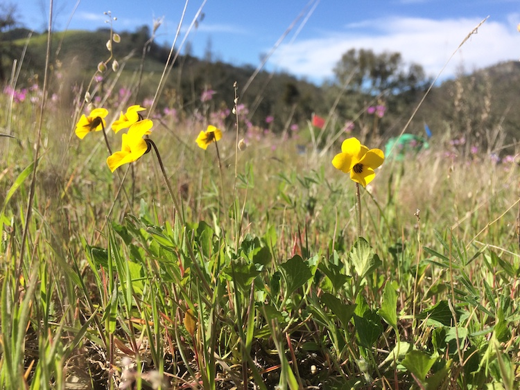

<!-- README.md is generated from README.Rmd. Please edit that file -->

```{r, include = FALSE}
knitr::opts_chunk$set(
  collapse = TRUE,
  comment = "#>",
  fig.path = "man/figures/README-",
  out.width = "100%"
)
```

# sedgwickspecies

<!-- badges: start -->
<!-- badges: end -->

__*Viola douglassii* at Sedgwick__  

This package provides standard plant names and synonyms for use in community ecology projects at the [University of California Sedgwick Reserve](https://sedgwick.nrs.ucsb.edu/) in Santa Barbara County, CA. This list is mainly for use by the [Kraft Lab at UCLA](https://sites.lifesci.ucla.edu/eeb-kraft/) and the [Levine Lab at Princeton](https://eeb.princeton.edu/people/jonathan-levine). This draws on the created by Will Petry. 

## Installation

Install from [GitHub](https://github.com/) with:

``` r
# install.packages("devtools")
devtools::install_github("akleinhesselink/sedgwickspecies")
```
## Usage

`library(sedgwickspecies)` will load the following datasets:

* __sedgwick_plants__: dataframe with species names and field codes for all vascular plants recorded at Sedgwick Reserve. Plant list drawn from Calflora and the Sedgwick Reserve list. 

* __focal_species__: specific information on the species that have been used in experiments in the Levine and Kraft labs at Sedgwick. 


