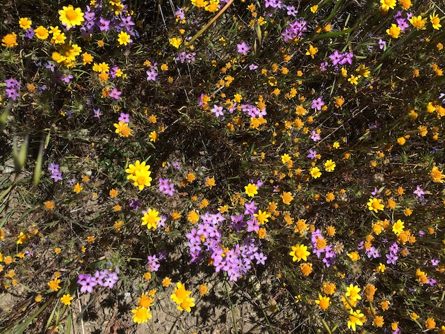

<!-- README.md is generated from README.Rmd. Please edit that file -->

# sedgwickspecies

<!-- badges: start -->

<!-- badges: end -->

 **Annual
wildlfowers at Sedgwick**

This package provides standard plant names and synonyms for use in
community ecology projects at Sedgwick reserve. This is mainly for use
by the Kraft lab at UCLA and the Levine lab at ETH Zurich. This depends
on the “SedgwickTaxonomy” repository created by Will Petry.

## Installation

Install from [GitHub](https://github.com/) with:

``` r
# install.packages("devtools")
devtools::install_github("akleinhesselink/sedgwickspecies")
```

## Usage

``` r
library(sedgwickspecies)
```

`library(sedgwickspecies)` will load the following datasets:

  - **sedgwick\_plants**: dataframe with species names and field codes
    for all vascular plants recorded at Sedgwick Reserve.  
  - **focal\_species**: specific information on the species that have
    been used in experiments in the Levine and Kraft labs at Sedgwick.

You can also embed plots, for example:


In that case, don’t forget to commit and push the resulting figure
files, so they display on GitHub\!
